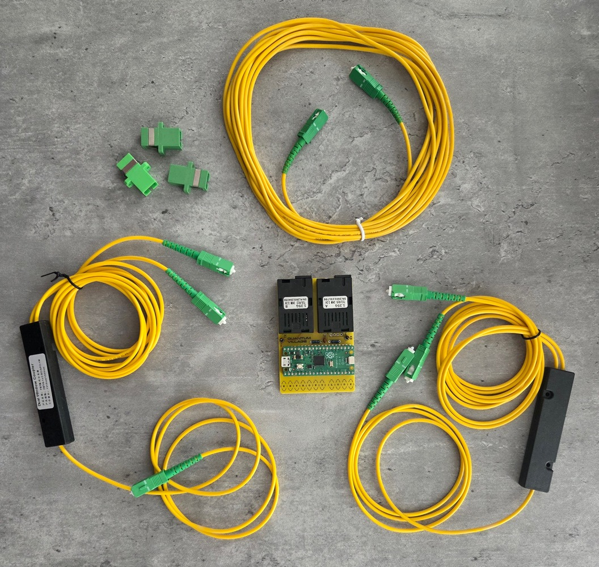
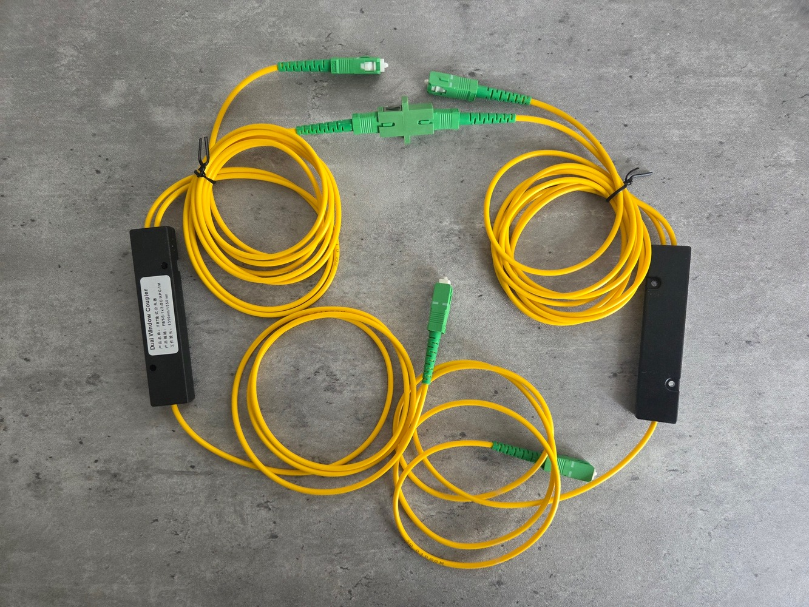
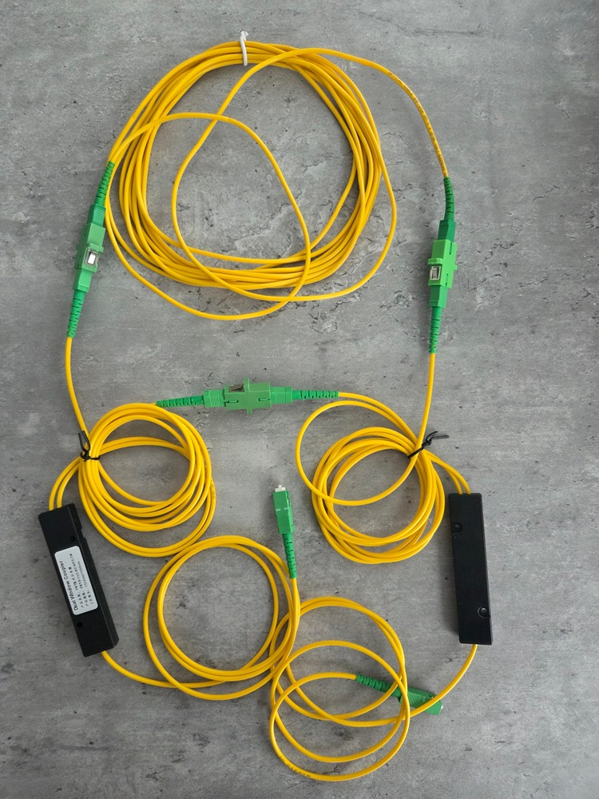
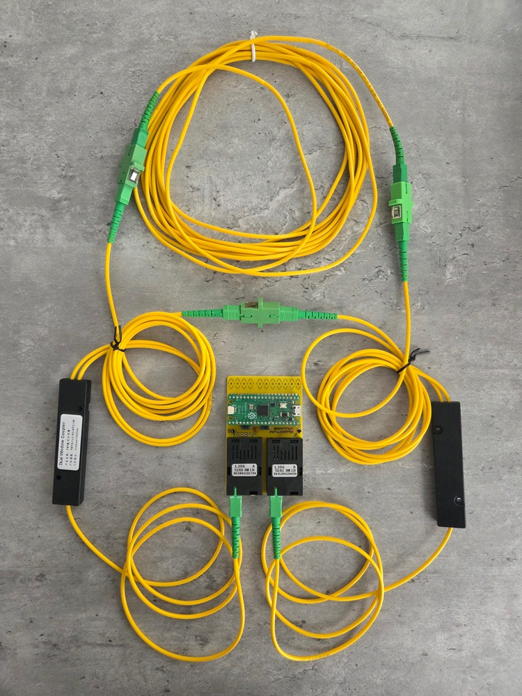

# Build Instructions

## PCB Build

Once you have the PCB and parts, they should be soldered in height order. This is roughly (depending on which parts you have):

1. Resistors first
1. The ceramic capacitor
1. The oscilloscope hook loops
1. The 20x1 pin standoffs for the RPi Pico
1. The two fiber transcievers

With these soldered in place, you are ready to load the firwmare. 

## Flashing the Pico Firmware

Download the `entropy_gen.uf2` file. Whilst holding down the `BOOTSEL` button on the RPi Pico, plug the pico into a USB port using the USB-C to microUSB cable. The RPi Pico should now appear as a drive. 

Using a file manager window, drag the `entropy_gen.uf2` file onto the RPi Pico drive. The drive should automatically disconnect, and it's successfully flashed! 

For full instructions [see the offical Raspberry Pi Pico documentation.](https://projects.raspberrypi.org/en/projects/getting-started-with-the-pico/3)

## Fiber Optic Assembly 

In order to finish and build your EntropyLoop, you'll need all the parts in this photograph:

These are:

1. 1x completed Entropy Loop PCB or equivalent. 
1. 2x 1x2 fiber splitters
1. 3x Fiber Optic Couplers
1. 1x 5 meter fiber optic cable

All of our parts in this build use SC/APC connectors, which are usually rectangular green connectors with a raised ridge on the top of the connector. This ridge aligns with cutaways on the fiber couplers and fiber ports on the transcievers. SC/APC has an 8 degree angle cut at the end of the fiber so that they mate closely and minimise erroneous noise in the system. 

To begin assembly, first take the two 1x2 splitters, and identify the double side of the splitter. Each of these take the signal from the single fiber side, and split it 50/50 on the double fiber side.

Begin by using a fiber coupler and connect one of the split fiber  ends together, like so:

Then to the other split fiber end, attach the 5m delay loop as so:

Finally, take the single fiber ends and plug them into the transcievers on the PCB, like so:

This is the completed build! Congratulations - you now have you own PD-QRNG Entropy Loop!