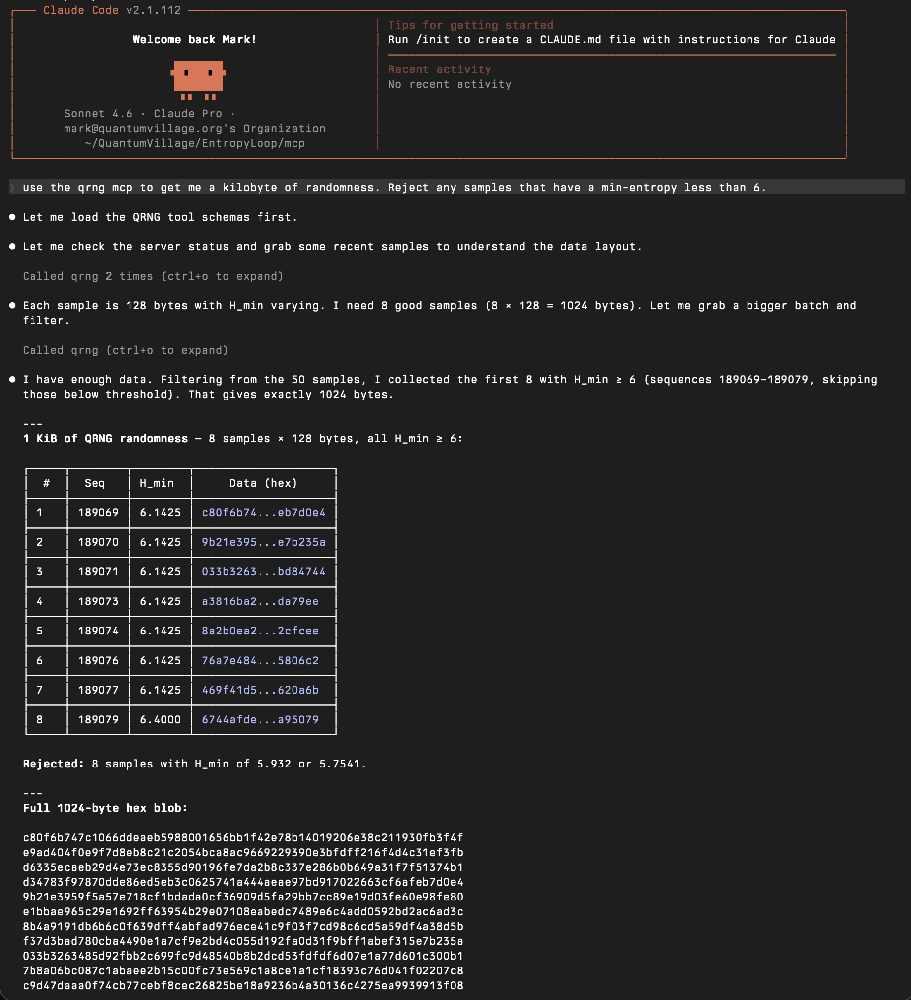

# MCP 4 Entropy Loop - Enabling QRNG for AI!

We are very happy to bring you the first ever AI ready QRNG! To do this, we've worked with ChatGPT and Claude to bring you an MCP server for your QRNG. This gives you AI access to quantum randomness through 4 tools - 

1. `get_server_status` - Check on the status of the server
1. `get_latest_qrng_sample` - Acquire some entropy
1. `get_recent_qrng_samples` - get a batch of `n` many samples
1. `wait_for_next_qrng_sample` - block for a QRNG sample, or timeout expires

These allow your AI agents access to quantum randomness and entropy for your experiments. Happy AI Hacking!

## How to Install and Connect

Run the following in this directory:

```bash
python3 -m venv .venv
source .venv/bin/activate
pip install -r requirements.txt
```

Then use `run.sh` or the following commands. Adjust the serial device accordingly:

```bash
export USB_DEVICE=/dev/ttyACM0
export USB_BAUD=115200
export HOST=127.0.0.1
export PORT=8000

source .venv/bin/activate
python3 qrng_mcp_server.py
```

This server is 'local only'. If you want to connect remotely, we recommend running SSH with the following commandline switches:

```bash
ssh -L 8000:localhost:8000 user@host
```

**NB** - we recommend _NOT_ setting the `HOST` to anything other than `127.0.0.1`. If you set it to `0.0.0.0` it will be available on your network, and there is no TLS/encryption, set authentication, nor security guarantees in this PoC. Using an SSH tunnel is much more preferable for this locally hosted MCP. 

## Testing the MCP Server

We recommend to use `npx @modelcontextprotocol/inspector` for testing. When connected, set the transport type to 'Streamable HTTP', and the Connection Type to 'Direct'. Then set the URL to `http://127.0.0.1:8000/mcp`. You should then be able to go to the `Tools` tab and see the status of the server and get some QRNG! 

## How to add to Claude code

Use this command to add the QRNG MCP server to Claude:

```bash
claude mcp add --transport http qrng http://127.0.0.1:8000/mcp
```

Once this is successful, check the connection in the `/mcp` command, and then try using a prompt such as:

> Use the qrng mcp to get me a kilobyte of randomness. Reject any samples that have a min-entropy less than 6. 

You should see output similar to this: 



Other interactions may look like this:

```
❯ what is the current status of the qrng mcp?                                                                                                                
                                               
  Called qrng (ctrl+o to expand)                                                                                                                             
                                                                                                                                                             
⏺ The QRNG MCP is connected and healthy:                                                                                                                     
         
  - Port: /dev/ttyACM0 @ 115200 baud                                                                                                                         
  - Samples received: 6,685,203    
  - Last sample: 2026-04-17 05:01:40 UTC                                                                                                                     
  - Last error: none                                                                                                                                       
  - History buffer: 500 samples                                                                                                                              
                                                                                                                                                             
❯ get me 10 samples with min-entropy over 6                                                                                                                  
                                                                                                                                                             
⏺ I'll grab a larger batch and filter for H_min > 6.                                                                                                         
                                                                                                                                                             
  Called qrng (ctrl+o to expand)  
                                                                                                                                                             
⏺ Here are 10 samples with H_min > 6:                                                                                                                        
                                                                                                                                                             
  ┌─────┬──────────┬────────┬─────────────────┬─────────────────────────────────────┐                                                                        
  │  #  │ Sequence │ H_min  │ Timestamp (UTC) │     Data (hex, first 32 bytes)      │                                                                        
  ├─────┼──────────┼────────┼─────────────────┼─────────────────────────────────────┤                                                                        
  │ 1   │ 6694255  │ 6.1425 │ 05:02:19.961    │ b0f46d223d54238e13de6547f4a3ef8c... │                                                                        
  ├─────┼──────────┼────────┼─────────────────┼─────────────────────────────────────┤                                                                        
  │ 2   │ 6694256  │ 6.1425 │ 05:02:19.965    │ eecc63188cc81075190c2b5f4e8aba47... │                                                                        
  ├─────┼──────────┼────────┼─────────────────┼─────────────────────────────────────┤                                                                        
  │ 3   │ 6694257  │ 6.1425 │ 05:02:19.970    │ ee79163d1cb71cf942dc5b81fda07e11... │                                                                        
  ├─────┼──────────┼────────┼─────────────────┼─────────────────────────────────────┤                                                                        
  │ 4   │ 6694258  │ 6.1425 │ 05:02:19.974    │ f74146eaa68a8610cb9bfe359c45ca7a... │                                                                        
  ├─────┼──────────┼────────┼─────────────────┼─────────────────────────────────────┤                                                                        
  │ 5   │ 6694260  │ 6.1425 │ 05:02:19.983    │ 1eba89874486c6c77cc57ec306c23ce7... │                                                                      
  ├─────┼──────────┼────────┼─────────────────┼─────────────────────────────────────┤                                                                        
  │ 6   │ 6694267  │ 6.1425 │ 05:02:20.013    │ 0dc5593cea563e58c3ede68239c19ca9... │                                                                      
  ├─────┼──────────┼────────┼─────────────────┼─────────────────────────────────────┤                                                                        
  │ 7   │ 6694270  │ 6.1425 │ 05:02:20.026    │ 7ddc1ef954eba09a66607755dc42f737... │                                                                      
  ├─────┼──────────┼────────┼─────────────────┼─────────────────────────────────────┤                                                                        
  │ 8   │ 6694271  │ 6.1425 │ 05:02:20.031    │ 248a8068e3ebca9ace9d9124471a20fb... │
  ├─────┼──────────┼────────┼─────────────────┼─────────────────────────────────────┤                                                                        
  │ 9   │ 6694279  │ 6.1425 │ 05:02:20.066    │ 0851aa2b76f358367d687dcc45d66546... │
  ├─────┼──────────┼────────┼─────────────────┼─────────────────────────────────────┤                                                                        
  │ 10  │ 6694346  │ 6.4000 │ 05:02:20.358    │ 090b0d137ef117efd874a8a024c3f70a... │
  └─────┴──────────┴────────┴─────────────────┴─────────────────────────────────────┘                                                                        
                  
  All are 128-byte samples. Notable: seq 6694346 has the highest H_min at 6.4 — the only one above 6.1425 in this batch.                                     
                  
────────────────────────────────────────────────────────────────────────────────────────────────────────────────────────────
❯                                          
────────────────────────────────────────────────────────────────────────────────────────────────────────────────────────────
  ? for shortcuts  
```
